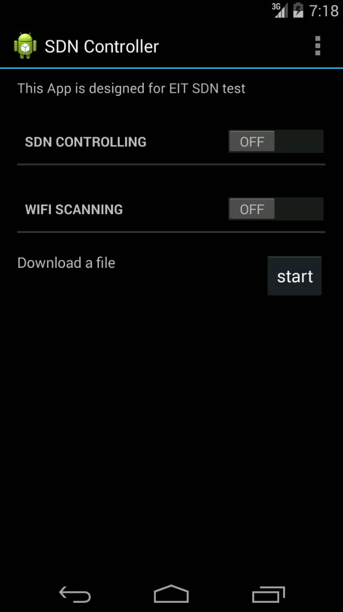

# Android SDN Controller -- SoftOffload Client

The Android SDN controler is a client-side extension designed for SoftOffload to support intelligent traffic offloading. It helps the central controller of SoftOffload to collect user-based information, and responses to requests from the central controller.

## Screenshots

